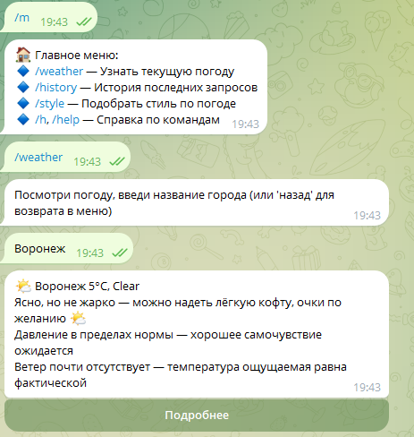

# weather-clothing

__weather-clothing__ - pet проект, который позволяет вам узнать _актуальную погоду_ по выбранному городу/селу/району, даёт _советы по стилю_ одежды в зависимости от погодных условий, а также _сохраняет историю запросов в базу данных_. Основной вектор этого проекта - подборка стилей, которые формируются из немалого количества вводных. Акцент в этом проекте был сделан на работу с базой данных + внешнее получение информации

В данной работе представлена как CLI-версия (изначально разрабатывалось под неё), а также TelegramBot с 85% функционалом CLI версии.
# Установка
* Клонируйте репозиторий

```bash
https://github.com/ArchyBalt1/weather-clothing.git
```
* Настройте переменные окружения с помощью папки __.env__
  
  Создайте файл .env и укажите:
```ini
OPENWEATHER_KEY=your_token_here
DB_HOST=localhost
DB_PORT=5432
DB_USER=your_user
DB_PASSWORD=your_password
DB_NAME=your_database
TGBOTTOKEN=your_telegram_token
```
_Файл .env.test использовался для теста бд, где была создана отдельная тестовая база данных. [API](https://openweathermap.org/api) для получения погодных условий. Чтобы получить tgbot_token, воспользуйтесь **@BotFather** в телеграмм_
* Настройте базу данных
  
  В корне проекта есть файл **dump.sql**, в котором полностью готовая к работе база данных, со схемой и данными. Для работы с ней:
    * Создайте пустую базу в PostgresSQL
    * Выполните команду
```bash
psql -U your_user -d your_dbname -f dump.sql
```
  * Установите зависимости
```bash
go mod tidy
```
# Запуск
* Для CLI версии

  Перейдите в папку **server** (weather-clothing/cmd/server) и запустите:
```bash
go run main.go
```
* Для Telegram бота
  
  При запуске CLI версии будет выбор, что запустить
```os.Stdin
Хотите запустить TelegramBot? y/any_key
>
```
# Функционал
* CLI версия
  
  При запуске CLI версии вы сможете выбрать три пункта меню. Начнём с погодных условий. Здесь можно узнать погоду в любой точке мира + будут даны комментарии по **состоянию погоды, давлению и ветре**, которые рандомно выбираются из бд относительно данных
  
  

  Также возможно посмотреть историю запросов. В бд хранится информация последних 10 записей
  
  

  Выбор стиля. Здесь учитываются **температура, состояние, скорость ветра и время года**. Относительно этих параметров выводится *название стиля, описание, а также необходимые аксессуары*, если под данную погоду они требуются

  .png)
  
  Если стиля под погоду ещё не добавлено в базу, выводится общее сообщение
  
  .png)

  Также, если выбирать из последних 10 записей, вначале можно посмотреть подробности, а уже затем выбрать. Это основной функционал CLI версии
  ___
* TelegramBot
  
  Здесь реализовано всё вышеописанное, за исключением мелких удобств, которые были продуманы в CLI. А вот какие именно, узнайте сами)

  

  

  

  Чтобы начать, введите **/start**. Для справки по командам и описание ~~/help~~ **/h**
  # Структура проекта
  ```bash
  /cmd
     /server
        app.log // хранение логов
        main.go // точка входа
  /internal
     /db
        /postgres.go // работа с sql запросами
     /logic
        logic.go // логика, которую можно было вынести в отдельную функцию
     /models
        models.go // необходимые структуры для работы
     /output
        /cli.go // вывод CLI версии
     /telegram
        bot.go // вывод TelegramBot
     /weather
        weather.go // работа с внешним API погоды
  ```
  # Планы на будущее
  * Работа с прогнозом на несколько дней (планируется 6), но оставить прежний курс, связанный с подборкой стилей
  * Добавка некоторых городов в избранное, чтобы иметь к ним быстрый доступ
  * Глубокая интеграция с телеграмм, использование всех его возможностей 
